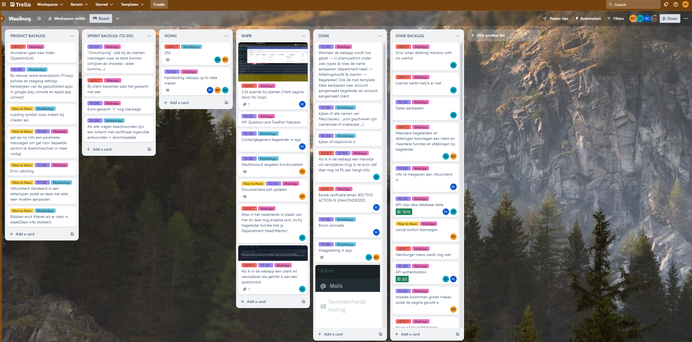

# 17.1 Beschrijven en rekening houden met de relevante ITIL practices

## Inleiding
In dit verslag beschrijf ik hoe ik binnen het project De Waaiburg rekening heb gehouden met Change Management, dit specifieker met behulp van de Agile-methode.

Dit project van De Waaiburg was om hun bestaande app uit te breiden met enkele nieuwe functionaliteiten. Dit bleek echter niet direct te gaan lukken doordat de bestaande webapp en app niet zo goed geschreven waren en dus opnieuw gemaakt zouden moeten worden. 

Dit hebben we dan gedaan, de webapp is puur administratief waarbij ze hun cliënten kunnen toevoegen voor vragenlijsten te sturen, de content van hun app beheren en vragenlijsten toevoegen. De app bestaat uit 2 gedeeltes, het open stuk en gesloten stuk. Het open stuk is beschikbaar voor iedereen en hier kan je informatie krijgen over De Waaiburg zelf en wat ze doen of waar ze voor staan. Het gesloten stuk dient voor hun interne cliënten om op een speelse manier via een vragenlijst met animaties hun verleden te helpen verwerken.

## Agile
Wat is Agile precies? Agile is een flexibele manier van werken, die vooral in de IT-sector vaak gebruikt wordt. Hierbij werk je in "sprints", vaste periodes van meestal 1 of 2 weken. Aan het begin van de week wordt bepaald wat iedereen gaat doen en of er nog obstakels zijn. Zo kan de projectleider goed weten waar iedereen mee bezig is en hulp bieden of bijsturen waar nodig.

## Change Management
Wat is Change Management? Change Management is veel gestructureerder dan Agile. Het richt zich op het plannen, beheren en ondersteunen van veranderingen binnen een organisatie. Dit begint met het vaststellen van de noodzaak voor verandering en het formuleren van duidelijke doelen. Vervolgens worden alle betrokkenen geïnformeerd en voorbereid door middel van effectieve communicatie en training. Een belangrijk aspect is het beheren van weerstand, waarbij ondersteuning en betrokkenheid worden geboden. Gedurende de implementatie wordt de voortgang zorgvuldig gemonitord en geëvalueerd, en worden aanpassingen gedaan om ervoor te zorgen dat de veranderingen duurzaam en succesvol zijn. Change Management zorgt ervoor dat de overgang naar de nieuwe situatie soepel verloopt en dat alle stakeholders de verandering begrijpen en accepteren.

## Change Management in het project
Bij het project van De Waaiburg, zeker vanwege de omvang, was het belangrijk om wekelijkse doelen te stellen. Daarom hebben wij gebruik gemaakt van de Agile-methode met sprints en sprintdemo's bij de klant. Dit was belangrijk om ervoor te zorgen dat er elke week voortgang was en we het project op tijd konden afronden.

Telkens als we naar de klant gingen met een sprintdemo, konden zij onze voortgang zien en hierop feedback geven. Onze klant was niet technisch onderlegd, waardoor we alles goed moesten uitleggen zodat iedereen het begreep. Een voorbeeld hiervan is dat ze aangaven dat er meerdere enquêtes verstuurd moesten kunnen worden. Dit was belangrijke feedback waarmee we rekening hielden bij het ontwikkelen van deze feature.

## Trello in actie
Om ons overzicht te bewaren en gebruik te maken van deze wekelijkse sprints, hebben wij het programma Trello gebruikt. Dit programma is ideaal hiervoor, waarbij je de kolommen zelf kunt indelen. Wij hebben dit gedaan met de kolommen Backlog, To-Do, Doing, W4FB, Done en Done Backlog. Zo wist iedereen wat er nog gedaan moest worden en waar iedereen mee bezig was.

## Reflectie en verbeterpunten
Omdat we zo snel mogelijk wilden werken, werd soms wat minder aandacht besteed aan Trello, zoals het verschuiven van kaartjes die al gedaan waren of het aanmaken van nieuwe kaartjes. De veranderingen en implementaties werden zeker gedaan, maar niet altijd goed bijgehouden via Trello. Dit is zeker iets waar we in de toekomst op kunnen verbeteren.

## Continual Improvement
Binnen dit project hebben wij continu gewerkt aan verbetering, zowel bij kleine als grote features. Het was belangrijk dat alles op de juiste manier en volgens de best practices werd gedaan, zowel voor veiligheid als optimalisatie. Dit is een belangrijk aspect van de Agile-methode; door hiervan gebruik te maken, kun je jezelf evalueren en bijsturen waar nodig. Voordat we ergens aan begonnen, hebben we dit eerst grondig uitgezocht om te kunnen garanderen dat we hier op een efficiënte manier aan werkten.